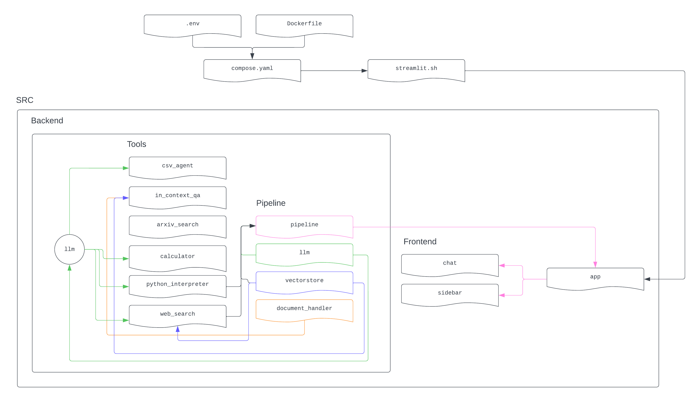

# AI Assistant

[Viktor Ciroski](https://viktor1223.github.io/ViktorCiroski.github.io/),
[Eugenio Culurciello ](https://www.linkedin.com/in/eugenioculurciello/),
[Pranav Jadhav](jadhav14@purdue.edu),
[Sravani Ramishetty](https://www.linkedin.com/in/sravaniramishetty/),
[Akshath Raghav R](https://www.linkedin.com/in/akshathrr), 
[Alexandre Sauquet](asauquet@purdue.edu),
[Shakti Wadekar](https://www.linkedin.com/in/shakti-nagnath-wadekar/)
<center>Listed in alphabetical order by last name</center>


<br>
Introducing AI ASSISTANT: 

A versatile Task Handling Framework (THF) designed for seamless integration and customization across diverse domains. Powered by Langchain's advanced technology, AI ASSISTANT provides a robust foundation for users to develop and adapt specialized solutions tailored to their specific needs. With an open-source approach, this framework offers flexibility for users to incorporate additional tools and make minimal modifications to tailor the assistant for their unique domain requirements. Whether it's data analysis, task automation, or predictive modeling, AI ASSISTANT empowers users to enhance efficiency and precision in a wide range of applications.


## ⚠️ Note
Project Status:
This project is currently in the developmental phase and actively undergoing enhancements. The Language Model (LLM) backend is presently powered by GPT-4, with imminent plans to transition towards a multi-modal approach, specifically leveraging the Llama2 Large World Model (LWM).

Tool Integration:
The current iteration of the project features the integration of several tools designed to augment its capabilities:
- **Arxiv Search:** Facilitating exploration and retrieval of scholarly articles.
- **Web Browser:** Enabling web-based research and information gathering.
- **Calculator:** Providing computational functionality within the environment.
- **Python Interpreter:** Supporting the execution of Python code for enhanced scripting capabilities.
- **In-context QA:** Offering question-answering functionality within the context of the project.
- **Data Chat:** Enabling data visualization and analysis support of uploaded CSV files. 

Modality Focus:
It's important to note that the current implementation is tailored for a singular modality, specifically text. Future iterations aim to broaden the scope by incorporating a multi-modal approach, thereby enhancing the project's capacity to process and analyze diverse types of data.

Try it our [FIRST DEMO](https://eugenio-a3n.streamlit.app)

 REDO With General Layout!


# Project Setup Guide

This guide provides detailed instructions on how to set up and run the Forestry_Student project. By following these steps, you'll be able to clone the repository, configure necessary environment variables, and start the application using Docker.



## Prerequisites

Before you begin, ensure you have the following installed on your system:
- [Git](https://git-scm.com/book/en/v2/Getting-Started-Installing-Git)
- [Docker](https://docs.docker.com/engine/install/)
- [Docker Compose](https://docs.docker.com/compose/install/)

## Installation

Clone the Forestry_Student repository and navigate into the project directory:

```bash
git clone https://github.com/e-lab/Forestry_Student.git
cd Forestry_Student
```

## Configuration

Create a `.env` file in the root directory of the project. This file should contain the necessary API keys for the application to function properly. Replace `<YOUR_GOOGLE_API_KEY>`, `<YOUR_GOOGLE_CSE_ID>`, and `<YOUR_OPENAI_API_KEY>` with your actual API keys.

```plaintext
# .env file
GOOGLE_API_KEY=<YOUR_GOOGLE_API_KEY>
GOOGLE_CSE_ID=<YOUR_GOOGLE_CSE_ID>
OPENAI_API_KEY=<YOUR_OPENAI_API_KEY>
```

### Obtaining API Keys

- **Google API Key & CSE ID**: Follow Google's documentation to [create an API key](https://support.google.com/googleapi/answer/6158862?hl=en) and [set up a Custom Search Engine (CSE)](https://programmablesearchengine.google.com/controlpanel/create).
- **OpenAI API Key**: Follow these instructions [to get your OpenAI key](https://www.maisieai.com/help/how-to-get-an-openai-api-key-for-chatgpt). Instead, log in to your OpenAI account and navigate to the API section to find your key.

## Startup

To build and start the application using Docker Compose, run the following command in the terminal:

```bash
docker-compose up --build
```

This command builds the Docker images and starts the containers defined in your `docker-compose.yaml` file. If this is the first time you're running the command, it might take some time to download the necessary images and dependencies.

## Accessing the Application

Once the application is running, you can access the web interface by opening your web browser and navigating to:

```
http://localhost:8501
```

## Troubleshooting

- If you encounter any issues with Docker, ensure Docker is running on your system and try restarting it.
- For problems related to API keys, double-check that they are correctly entered in the `.env` file with no extra spaces or characters.

## Acknowledgement 
This project has been undertaken in the Eugenio Culurciello e-lab at Purdue University, in collaboration with the FACAI lab. We extend our sincere appreciation to both labs for their invaluable contributions and collaborative efforts. Furthermore, we acknowledge and express gratitude for the resources generously provided by the Purdue Institute of Physical AI, which have played a crucial role in supporting and advancing our research endeavors.

## Citation 

```
@software{FIRST,
author = {Ciroski, Viktor and Culurciello, Eugenio and Jadhav, Pranav and Ramishetty, Sravani and Ravikiran, Akshath Raghav and Sauquet, Alexandre and Wadekar, Shakti},
title = {{Forest Intellect Research & Technology System}},
url = {https://github.com/e-lab/Forestry_Student/tree/main},
version = {0.0.1}
}
```